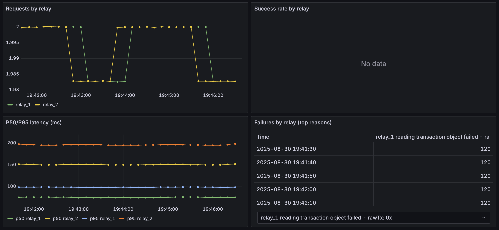

# shield rpc

MEV-protected transaction router with simple endpoints and Prometheus metrics.

Think of it like a smart mail room: you hand it a sealed envelope (your signed tx), and it chooses the safest, fastest private courier (Flashbots, MEV-Blocker, etc.). If the first courier is down, it tries the next — and logs everything so you can see what happened.

## Why
- Reduce failed-tx gas waste and sandwich risk
- Measure relay health, latency, and success rate
- One simple endpoint instead of juggling multiple relay APIs

## Quickstart
Requirements: Node 20+

```bash
# install deps
npm ci

# build and run
npm run build
npm start
# server: http://localhost:8080
```

Environment variables:
- `PORT` (default: 8080)
- `RELAY_URLS` (optional): comma-separated list of JSON-RPC endpoints to try in order. Example:
  - `RELAY_URLS=https://rpc.flashbots.net,https://rpc.mevblocker.io`

## Endpoints

Note: both /health and /healthz are available.
- `GET /healthz`
  - Returns `{ "status": "ok" }` if the service is up
- `GET /metrics`
  - Prometheus exposition format (relay latency/success/fail, etc.)
- `POST /sendRawTransaction`
  - Body: `{ "rawTx": "0x...signedTx..." }`
  - Tries relays in order until one accepts; returns `{ "relay": "name", "txHash": "0x..." }`
  - On failure: `502` with `{ "error": "relay_failure", "message": "..." }`

### curl examples
```bash
# health
curl -s http://localhost:8080/healthz | jq

# metrics
curl -s http://localhost:8080/metrics | head -n 20

# send raw tx (replace with a real signed tx)
curl -s -X POST http://localhost:8080/sendRawTransaction \
  -H 'content-type: application/json' \
  -d '{"rawTx":"0xSIGNED_RAW_TX"}' | jq
```

## Configuration & behavior
- Fallback: relays are attempted sequentially until success
- Defaults: Flashbots Protect, MEV-Blocker (override with `RELAY_URLS`)
- Metrics: relay request/response counts and latency histograms

## Docker
```bash
# build
docker build -t shield-rpc:dev .
# run
docker run --rm -p 8080:8080 \
  -e RELAY_URLS="https://rpc.flashbots.net,https://rpc.mevblocker.io" \
  shield-rpc:dev
```

## Roadmap (next)
- Add BlockSec Anti-MEV relay adapter
- Add simulation endpoint and policy rules
- Per-project API keys and rate limits
- Grafana dashboard JSON

## License
Apache-2.0

### CLI demo
Note: when passing arguments to npm scripts, include `--` before the CLI args so they reach the script.
```bash
# measure relay latencies
RELAYS="https://rpc.flashbots.net,https://rpc.mevblocker.io" npm run -s cli -- ping --relays $RELAYS

# compare shield vs public (simulate without sending)
npm run -s cli -- send --shield http://localhost:8080 --public https://rpc.flashbots.net --simulate

# optional: generate a bit of load so Grafana shows non-zero series
for i in {1..20}; do npm run -s cli -- send --shield http://localhost:8080 --public https://rpc.flashbots.net --simulate; sleep 1; done
```

### Grafana
- Import `dashboards/shield-rpc-grafana.json` into Grafana.
- Example Prometheus scrape config in `docs/prometheus-scrape-example.yml`.

### Dashboard preview


## End-to-End demo (Docker Compose)

```bash
# 1) Optional: set relays
cp -n .env.example .env || true
# edit .env if you want custom RELAY_URLS

# 2) Build and start the stack (shield + Prometheus + Grafana)
docker compose up --build

# 3) Verify services
# shield-rpc:   http://localhost:8080/health  (or /healthz)
# Prometheus:   http://localhost:9090
# Grafana:      http://localhost:3000  (user: admin, pass: admin)

# 4) Dashboard
# Grafana auto-loads the Prometheus datasource and imports dashboards/shield-rpc-grafana.json
# Open the dashboard named "shield-rpc overview"

# 5) Generate traffic from another terminal
RELAYS="https://rpc.flashbots.net,https://rpc.mevblocker.io" npm run -s cli ping --relays $RELAYS
npm run -s cli send --shield http://localhost:8080 --public https://rpc.flashbots.net --simulate

# 6) Tear down
# Press Ctrl+C in the compose terminal, or:
docker compose down -v
```

### Demo mode (hands-free traffic)
Enable a built-in traffic generator so Grafana stays lively without manual loops.

```bash
# enable demo mode (750ms interval) and rebuild shield
npm run -s demo:on

# speed it up (250ms interval)
npm run -s demo:fast

# turn demo mode off
npm run -s demo:off

# environment overrides (when calling demo:on)
#   DEMO_INTERVAL_MS=500 npm run -s demo:on
```
